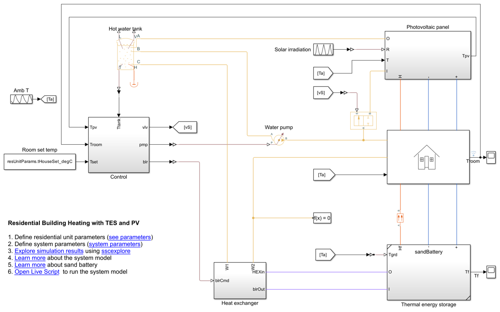

# Residential House Heating with Thermal Energy Storage (TES) 
 Climate change and its effects on the day-to-day life are an upward trend. 
To offset the ill effects of climate change, all major world economies adapted aggressive plans to cut the greenhouse emissions.
Renewable energy sources are a promising solution to meet 
the increasing energy demands and reduce the carbon footprint.
To bridge the gap between the demand and the generation of the renewable power, you must design an effective energy storage system.     

The market offers different energy storage technologies. 
While you cannot standardize the storing of electrical power for all applications, you can possibly use the TES to replace 
the electrical heating and burning of fossil fuels for heating buildings.
Before installing a TES hardware, you must also perform a basic analysis of return on capital investment.

This repository contains models to help you design thermal energy storage systems (TES) and select photovoltaic (PV) panels for heating residential buildings. By taking a deep dive into the workflow, you will learn about
1) Design a sand thermal energy storage system for heating a residential house.

2) Selecting a PV panel to charge the energy storage system.
3) Key peripheral subsystems (pumps, heat exchangers etc.) and their design.
4) Perform a cost feasibility analysis.

**Installation Cost Break-Even Period**

## Setup 
* Clone the project repository.
* residentialHeatingWithSandTES.prj to get started with the project. 
* Requires MATLAB&reg; release R2023a or newer.

Copyright 2023 - 2024 The MathWorks, Inc.
